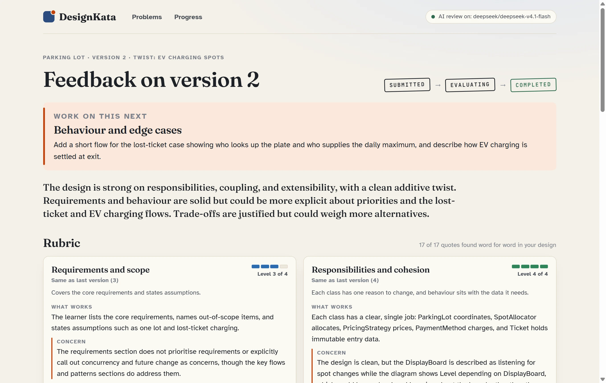
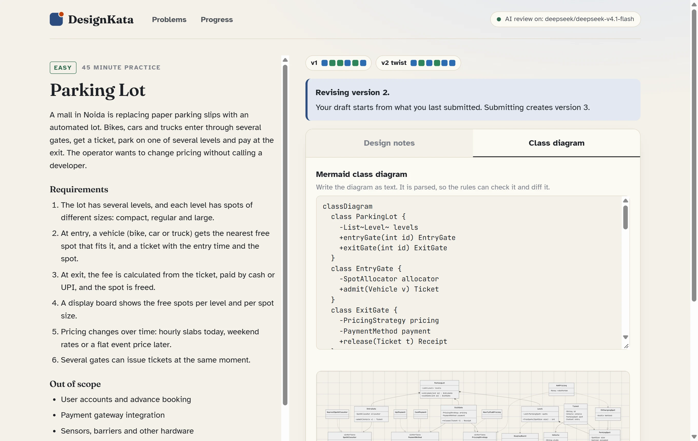
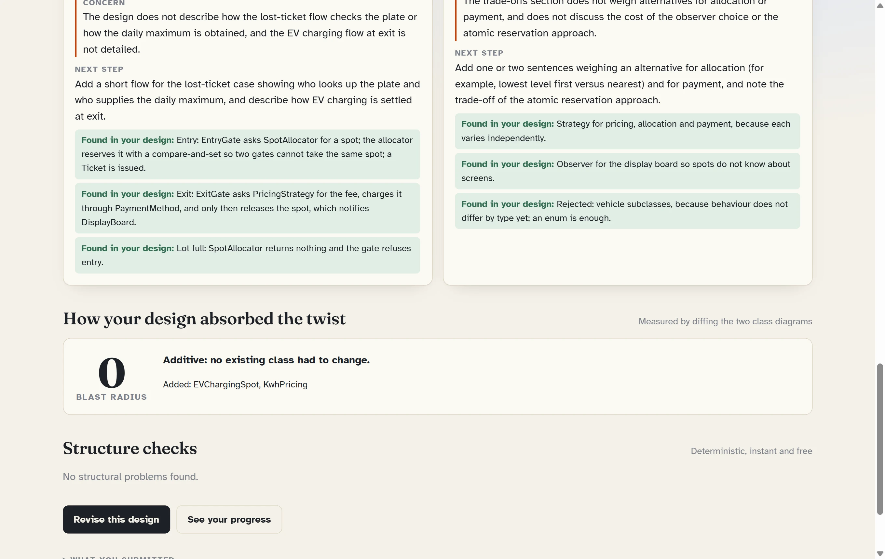

# DesignKata

**LLD practice with feedback you can check.**

Pick a low-level design problem, write short notes and a class diagram, and submit. Rules check the structure in about a second. An AI reviewer then judges six qualities, and every judgment has to quote your own words. Code verifies each quote. Then take the twist: a new requirement, the way an interviewer adds one. DesignKata diffs your two class diagrams and tells you how many existing classes the change forced you to edit.

Built by Devank Srivastava for the CipherSchools engineering assignment, September 2026.



**Documents:** [Research note](docs/research-note.md) · [Design note](docs/design-note.md) · [Decision log](docs/decisions.md) · [AI usage](AI_USAGE.md) · PDFs in [`docs/pdf/`](docs/pdf/)

## Try it in 60 seconds

1. Run it locally with the two commands below, or open the live demo if one is linked on the repository page. The free host sleeps when idle, so the first load can take about a minute.
2. Open **Parking Lot**, click **Load sample design**, then **Submit for review**. The sample is a deliberately typical first attempt.
3. Rule findings appear within about a second. The rubric review follows in about 15 seconds. Look for the green "Found in your design" quotes.
4. Click **Take the twist**, add an EV charging spot to the diagram, submit, and read the blast radius.
5. Open **Progress** to see the weaknesses that keep coming back.

## Run it locally

Requires **Node 24** (see `.nvmrc`). Nothing else to install.

```bash
npm install
npm run dev
```

Open http://localhost:3000.

- **No database needed.** Without `MONGO_URI`, a local MongoDB starts by itself and keeps its data in `.data/mongo`, so your history survives restarts.
- **No key needed.** Without `OPENROUTER_API_KEY`, feedback is rules-only and the app says so. For the AI review, copy `.env.example` to `.env` and set `OPENROUTER_API_KEY`. The model defaults to `deepseek/deepseek-v4.1-flash`; set `LLM_MODEL` to use another one. `npm run check:llm` confirms the key works.

For production mode, run `npm run build && npm start`. Deployment is described in `render.yaml`: one web service, with MongoDB Atlas as the database.

## How it works



```
Choose a problem -> design (notes + Mermaid diagram) -> submit (202, stored first)
  -> rules (about 1 s) -> AI rubric review, every quote verified (about 15 s)
  -> revise (level changes per criterion) or take the twist (blast radius) -> progress
```

A submission is five guided notes (requirements, entities, flows, trade-offs, edge cases) plus a class diagram written as Mermaid text. Because the diagram is text, it can be parsed into classes and relationships, checked, and diffed between versions.

Ten deterministic rules run instantly and cost nothing. They check the required sections, the diagram syntax, and whether the core concepts appear (matched by the names learners actually use). They also flag a god class, a part of the problem that varies but has no abstraction, dependency loops, orphan classes, public state, deep inheritance, and edge cases the notes never mention.

The rubric has six criteria, each on four levels that are described in words, and no total score. The AI reviewer must quote evidence before it picks a level, and `EvidenceVerifier` checks every quote against what you wrote.

When a review is slow or fails, nothing is lost. The submission is stored first and a background worker claims the review with a lease, so rule findings show while the AI works. Provider errors are retried with backoff, and a failed review keeps its rule findings and can be retried. If the worker crashes, its job is picked up again, and the same `Idempotency-Key` never creates a duplicate.

The design note has the domain model, the state machine, the failure table and both change tests.



## Measured results

| What | Result |
|---|---|
| Calibration: weak, medium and strong designs, 3 reviews each (`npm run calibrate`) | Ordered correctly on 6 of 6 criteria; the widest spread was 1 level; 119 of 124 quotes verified |
| Consistency: 5 reviews of one design, in 2 configurations (`npm run experiment:consistency`) | 5 of 6 criteria gave the same level every run; 112 of 115 quotes verified |
| Dogfood: DesignKata's own class diagram through its own rules (`npm run dogfood`) | 23 classes, no findings |

## Scripts

| Command | What it does |
|---|---|
| `npm run dev` | API, worker and React app on one port, with hot reload |
| `npm test` | 171 tests: unit, integration and end to end, against a real MongoDB with a fake LLM |
| `npm run typecheck` | Type-checks the server and the web app |
| `npm run check:text` | Fails on em dashes, en dashes or anything that looks like an API key (runs in CI) |
| `npm run build` / `npm start` | Production build and server |
| `npm run check:llm` | Confirms the OpenRouter key and model work |
| `npm run calibrate` | Checks that the reviewer ranks designs of known quality correctly |
| `npm run experiment:consistency` | The research note's experiment |
| `npm run dogfood` | Runs DesignKata's own design through its rules |
| `npm run pdf` | Builds the submission PDFs with headless Chrome |

## Project layout

```
shared/                  the contract both sides share: types, and the rubric
server/src/domain/       Attempt, Submission, Evaluation (state machine), DesignModel, Problem
server/src/analysis/     one reader per submission format; the change-impact diff
server/src/evaluation/   the Evaluator seam, rules, LLM rubric evaluator, evidence verifier, pipeline
server/src/llm/          LlmClient seam, OpenRouter client with retries, fake client, structured output
server/src/persistence/  MongoDB models and repositories (idempotency, compare-and-set, leases)
server/src/app/          PracticeService (use cases), EvaluationWorker, progress, rate limiter
server/src/http/         routes, validation and error mapping
server/src/problems/     the four problems, as data
server/test/             unit and integration tests
web/src/                 React app: Problems, Workspace, Feedback, Progress
docs/                    notes, decision log, diagrams, experiment output, PDFs
```

## Limitations

- No accounts. The browser keeps a random learner id; a real product would use CipherSchools sign-in.
- The rules are heuristics. Thresholds such as eight methods for a god class are starting points to tune with real learners.
- The Mermaid parser covers the syntax learners write, not all of Mermaid.
- The calibration set is small (three designs on one problem), and the reviewer is strict, so level 4 is rare.
- Rate limiting (12 reviews per learner per hour) is per process. A shared store would take over with more than one instance.

## Author

Devank Srivastava · [LinkedIn](https://www.linkedin.com/in/devank-srivastava-8521131ab) · [GitHub](https://github.com/DevankS5)

Licensed under MIT.
