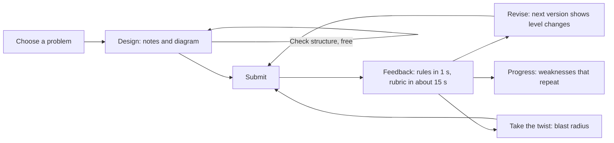
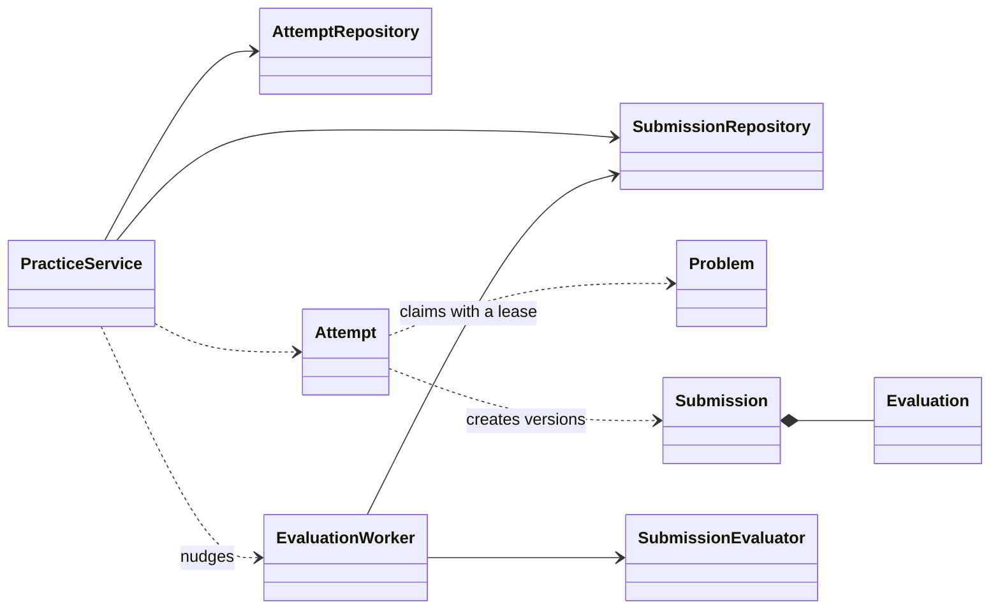
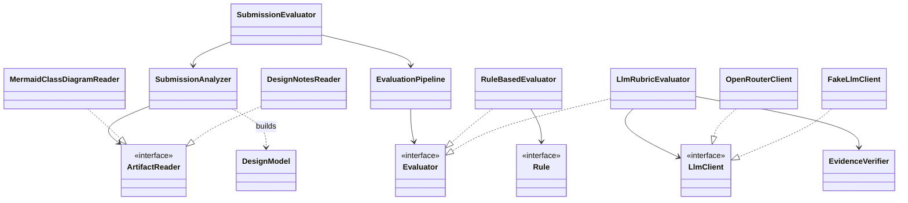
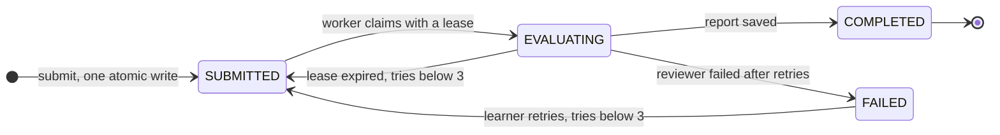
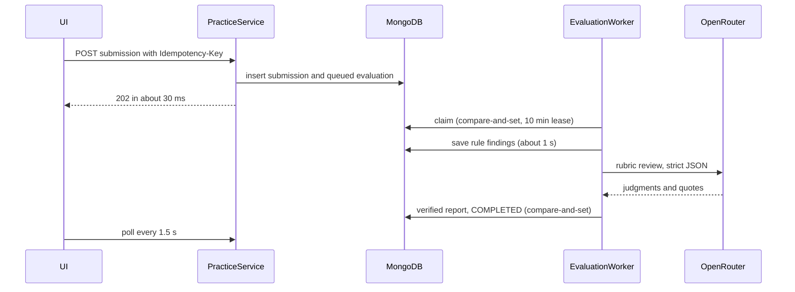

# Design note: DesignKata

Devank Srivastava · CipherSchools engineering assignment · September 2026 · github.com/DevankS5/designkata

## The five design questions, answered first

**1. What must a learner provide for an attempt to be meaningful?** Two things in one submission: five short notes (requirements and assumptions, entities and responsibilities, key flows, patterns and trade-offs, edge cases) and a class diagram written as Mermaid text. The notes carry the reasoning an interviewer listens for. The diagram carries the structure, and because it is text, the platform can parse it into classes and relationships, check it, and diff it between versions. A drawing would give pixels, and full code takes longer than a practice session should.

**2. What makes feedback useful when many designs are valid?** Three things. It judges qualities, not closeness to an answer: six criteria on four anchored levels, with each problem's accepted variants given to the reviewer so it does not reward one shape. It shows evidence: every judgment quotes the learner and code checks each quote. And it tests change: after the first review a twist arrives, and the platform counts how many existing classes had to change. Two very different designs can both do well if both absorb change locally.

**3. What is deterministic and what needs an LLM?** Deterministic, instant and free: parsing, required sections, concept coverage, design smells (god class, a variation point with no abstraction, dependency loops, orphan classes, public state, deep inheritance), edge-case coverage, the change diff, state transitions, idempotency and evidence verification. The LLM judges the six rubric criteria and writes the concern and the next step. The rules run first and their findings go to the LLM as facts, so it builds on them instead of rediscovering them.

**4. How would it take a new submission format or evaluator?** A new format is one new `Artifact` type and one `ArtifactReader`; evaluators only read the normalized `DesignModel`. A new evaluator is one more `Evaluator` in the composition root; the practice flow never calls an evaluator. Section 6 lists the exact files.

**5. What happens when evaluation is slow or fails?** Submitting stores the submission and queues its review in one atomic write and answers `202` in about 30 ms. A worker claims the job with a lease, saves the rule findings within a second, and adds the AI review about 15 seconds later. Provider errors are retried with backoff; a final failure keeps the rule findings and offers a retry (three tries in total). If the process dies, the lease expires and the job is claimed again. The same idempotency key never creates a second submission.

## 1. The MVP and the practice loop

Four problems, each stored as data (requirements, core concepts with the names learners use, variation points, edge cases, accepted variants and a twist): Parking Lot, Vending Machine, Elevator, and Campus Attendance Tracker, which comes from GalgotiasLife, an attendance app I built for my university.



## 2. Domain model

The practice side: use cases, the aggregate, and the job queue.



The evaluation side: how a submission is read, then judged.



| Class | What it owns | Why it exists |
|---|---|---|
| `Attempt` | One learner on one problem: the draft, and the rules for turning it into versions. It refuses empty work, returns the latest version for an unchanged design, and keeps the twist locked until a review completes. | The "try again" loop lives here. |
| `Submission` | An immutable snapshot (version, content, content hash, idempotency key) plus its `Evaluation`. | Evidence is never changed after the fact. |
| `Evaluation` | The state machine, the try count, the lease, and a version number used for compare-and-set. | The only place legal transitions are defined. |
| `ArtifactReader` | Turns one kind of artifact into structure. | A new format is a new reader. It has two implementations today. |
| `DesignModel` | Classes and relationships, plus queries: dependencies, subtypes, depth, loops. | Every evaluator reads this, never the raw input. |
| `Evaluator` | A way of judging: `deterministic` runs first, `judgment` may be slow or fail. | Rules and the LLM today; human review later. |
| `Rule` | One deterministic check that returns findings with evidence and a suggestion. | Ten small rules, each tested alone. |
| `LlmClient` | A model that answers in text. | OpenRouter in production, a scripted fake in tests. |
| `EvidenceVerifier` | Checks that each quote exists in the learner's text. | Stops invented evidence. |
| `EvaluationPipeline` | Runs rules, shares partial feedback, then runs judges and composes one report. | Coordinates evaluators without knowing their insides. |
| `EvaluationWorker` | Claims jobs with leases, runs them, recovers dead leases. | Keeps reviews off the request path. |
| `PracticeService` | The use cases behind every screen. | Knows the worker only as something to nudge. |

Repositories are concrete classes with no interfaces. Each has one implementation, and TypeScript's structural typing already lets a test pass a fake. Every interface in the codebase has at least two implementations today. As a check, the full domain diagram (`docs/diagrams/domain.mmd`) goes through DesignKata's own rules with `npm run dogfood`: 23 classes, 23 relationships, no findings.

## 3. The seams, in code

```ts
interface ArtifactReader<A extends Artifact> { readonly kind: A['kind']; read(artifact: A): ArtifactReading }
type ReaderRegistry = { [K in ArtifactKind]: ArtifactReader<Extract<Artifact, { kind: K }>> } // a new kind without a reader will not compile
interface Evaluator { readonly name: string; readonly kind: 'deterministic' | 'judgment'; evaluate(context: EvaluationContext): Promise<EvaluatorResult> }
interface Rule { readonly id: string; check(context: EvaluationContext): Finding[] }
interface LlmClient { readonly model: string; complete(request: LlmRequest): Promise<string> }
```

## 4. Evaluation

**Rubric.** Six criteria, together covering the helping guide's eight dimensions: (1) requirements and scope, (2) responsibilities and cohesion, (3) relationships, coupling and encapsulation, (4) abstraction and extensibility, (5) behaviour and edge cases, (6) trade-offs and communication. Each is judged on four levels, and each level is a sentence describing what a design at that level looks like. There is deliberately no overall score.

**The LLM contract.** The model answers in strict JSON keyed by criterion, so it cannot skip or repeat one. For each criterion it gives evidence, strength, concern, level, suggestion and confidence, in that order, which makes it quote before it commits to a level. Calls use temperature 0 and a fixed seed, and the learner's text is fenced as data so instructions inside it are ignored. zod validates every answer; an invalid one goes back once with the exact error, and a second failure is final.

Then code checks every quote against the learner's own text, and a criterion whose quotes all fail drops to low confidence. In testing this caught the model quoting our own rule finding as if the learner had written it. I fixed the prompt and kept the verifier.

**Measurements** (raw output in `docs/experiments/`):

| Check | Result |
|---|---|
| Calibration: a weak, a medium and a strong Parking Lot design, 3 reviews each | weak ≤ medium ≤ strong held on **6 of 6** criteria; means 1.7, 2.3, 3.2; widest spread 1 level; **119 of 124** quotes verified |
| Consistency: one design, 5 reviews, in two configurations | 5 of 6 criteria identical in every run; the two real faults were named at level 1 in 19 of 20 judgments; **112 of 115** quotes verified |
| A naive "rate 1 to 10" prompt, same design | Repeatable at temperature 0, but moved from 5 to 6 between configurations and says nothing about what to fix |

The reviewer is strict: even the strong design averaged 3.2, so level 4 has to be earned.

## 5. Lifecycle and failure handling





| Situation | Behaviour |
|---|---|
| Double click or network retry | The unique index on (attempt, idempotency key) returns the first submission. |
| Unchanged resubmission | Returns the latest version; no new review is paid for. |
| Provider timeout, 429 or 5xx | Up to three tries with exponential backoff and jitter, 45 s per call. |
| Invalid JSON from the model | One repair round with the validation error, then `FAILED`. |
| Final failure | `FAILED`, rule findings kept, retry available (three tries in total). |
| Worker crash | The lease expires and the job is requeued. A stale worker's write fails its compare-and-set. |
| Two workers, one job | The compare-and-set lets exactly one win (tested with concurrent claims). |
| Abuse of the demo key | Twelve reviews per learner per hour. |

## 6. The two change tests

**A. A new submission format** (the brief's text-to-diagram case is already done; next would be code):
- `shared/types.ts`: a `code` member in `Artifact`.
- `analysis/code-reader.ts`: a reader that builds a `DesignModel` from classes in the code.
- `defaultReaders()`: register it. Until this is done, the compiler refuses the build.
- `review-prompt.ts`: a heading.
- `http/validation.ts`: one schema branch.
- A UI tab.

The rules, the pipeline, the worker, the practice service and the storage do not change.

**B. Another evaluator:**
- **A synchronous one** (a second model, a static-analysis tool) is one line in `index.ts`.
- **Human review** is asynchronous by nature, so it needs:
  - one new state, `AWAITING_REVIEW`;
  - an endpoint where a reviewer posts a judgment;
  - the pipeline composing it with the rest.

The practice flow still only submits, nudges and reads reports.

## 7. Trade-offs

| Chose | Over | Because |
|---|---|---|
| Mermaid text | A drawing canvas | Parseable, diffable, and days cheaper; the preview still shows a diagram. |
| Levels per criterion | A score out of 100 | Says where to improve, and allows many good designs. |
| MongoDB, evaluation embedded in the submission | SQLite or two collections | Their stack; queueing a review is one atomic write with no transactions. |
| In-process worker with leases | A queue service | The brief asks for a monolith; the claim behaves like a real queue's. |
| Polling every 1.5 s | Server-sent events | Simpler, survives reloads, and a review takes seconds, not milliseconds. |
| A browser-kept learner id | Accounts | Accounts are out of scope; this would plug into CipherSchools login. |
| Reasoning off | Reasoning on | Same levels on the sample in 15 s instead of 41. |

## 8. Scale, lightly

The first thing to separate is the worker. It would run as its own process reading a real queue (BullMQ on Redis, or SQS) with the same claim-and-lease contract, so slow reviews never compete with web requests. Next, reviews would be cached by content hash so an identical resubmission costs nothing, and the rate limiter would move to Redis. MongoDB Atlas already handles more reads, and the queries are indexed by learner and by status.

## 9. Limitations and next steps

**Limitations.** There are no accounts; the learner id lives in the browser. The rules are heuristics, and thresholds such as eight methods are guesses to tune with real learners. The Mermaid parser covers the syntax learners use, not all of Mermaid. The calibration set is small: three designs on one problem. The free Render tier sleeps when idle, so the first request can take a minute.

**Next steps.** Human review, code submissions, a calibration set per problem, a timed interview mode, a hint ladder, and sign-in with CipherSchools accounts.

**Tests:** 171 across unit, integration and end-to-end, run against a real MongoDB with a fake LLM. They cover every rule, the state machine, idempotency, concurrent claims, lease recovery, a failed review and its retry, validation and ownership. CI runs them on every push.
